# Unconstrained-Optimization-for-Logistic-Regression
Solving unconstrained optimization for determining bridge class using Nelder-Mead &amp; Newton's Method

# Question 1

Fitting a logistic regression model by selecting between 4 – 6 inputs from the variables provided. The output variable is the bridge condition (which is binary).

## Part 1 - Importing Required Libraries

- Input Work

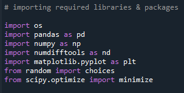

## Part 2 - Checking directory, reading and viewing the dataset 

- Input Work
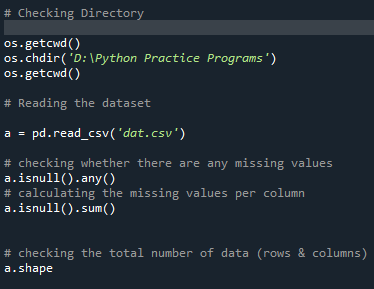

- Output
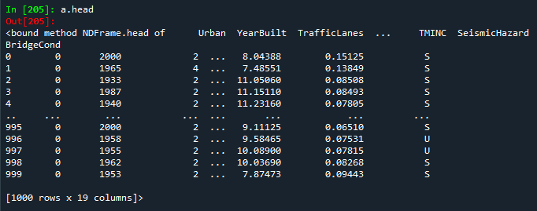

## Part 3 - Data Cleaning

- Input Work
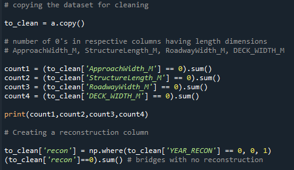
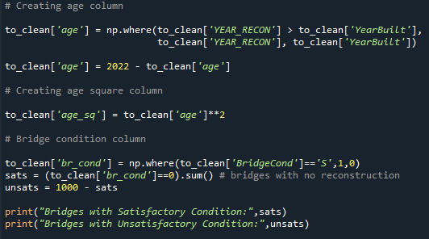

- Output Work
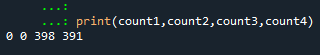
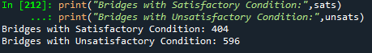

## Part 4 - Normalization and Feature Selection

- Input Work
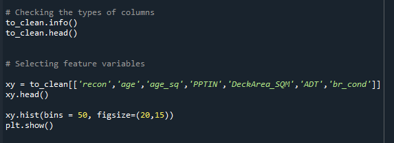
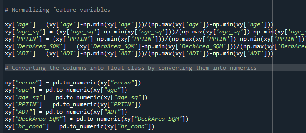

- Output
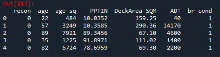
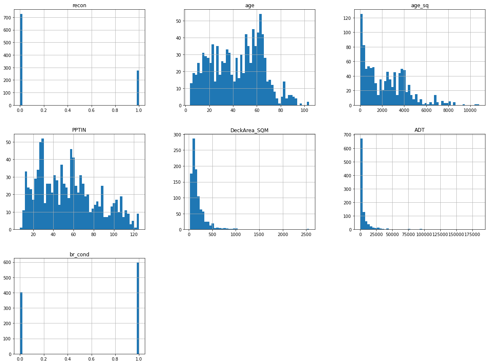

## Part 5 - Writing the logistic function

- Input Work
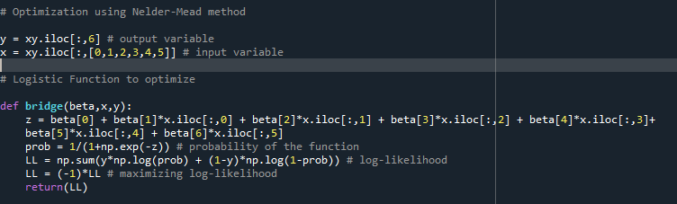

- Mathematical equation of written logistic function
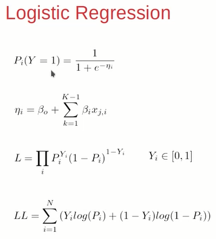

## Part 6 - Optimization using Nelder-Mead

- Input Work
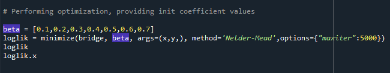

- Output
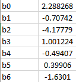

## Part 7 - Optimization using Newton's Method

- Input Work
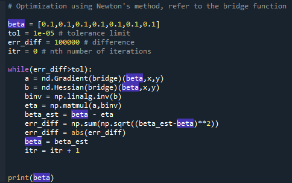

- Output
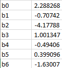

## Part 8 - Checking optimality of the function

- Input Work
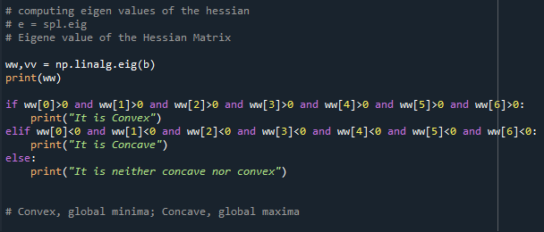

- It is a convex function with a global minima
- The eigen values are: 3.22444850e+02, 4.45930376e+01, 1.58613226e+01, 7.67344450e+00, 2.06681472e+00, 2.36034727e-01, 8.55399546e-01

# Question 2

To write a program to develop the 95% Confidence Levels for each of the estimated Model Coefficient of the Logistic Regression Model using the Bootstrap Approach

The code is similar from Part 1 - 4

## Random Sampling with Repetition

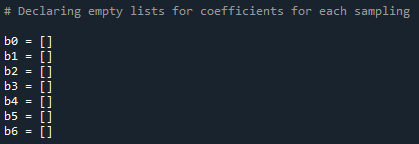
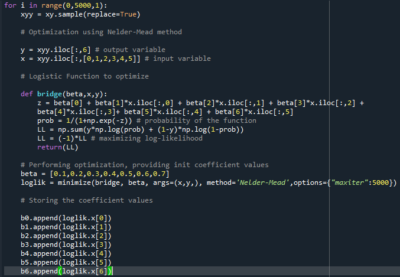

## Computing 95% confidence interval for the coefficients for 5000 samples

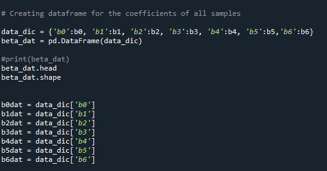
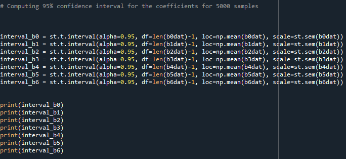

- Formula for calculating confidence interval
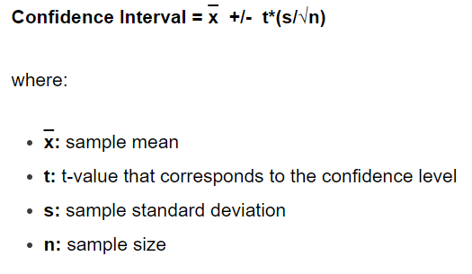
